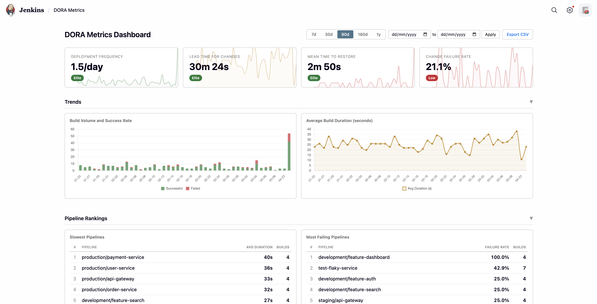
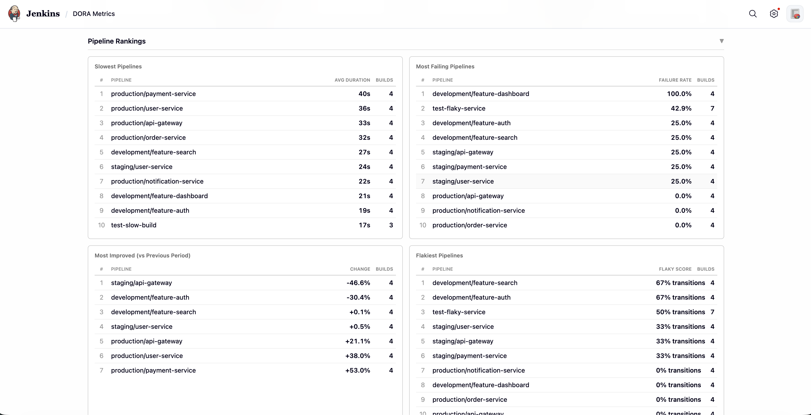
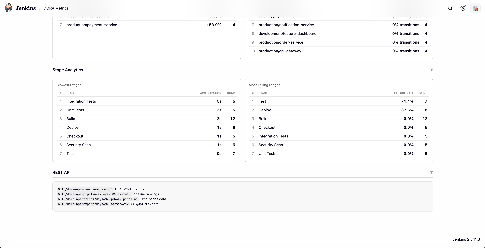
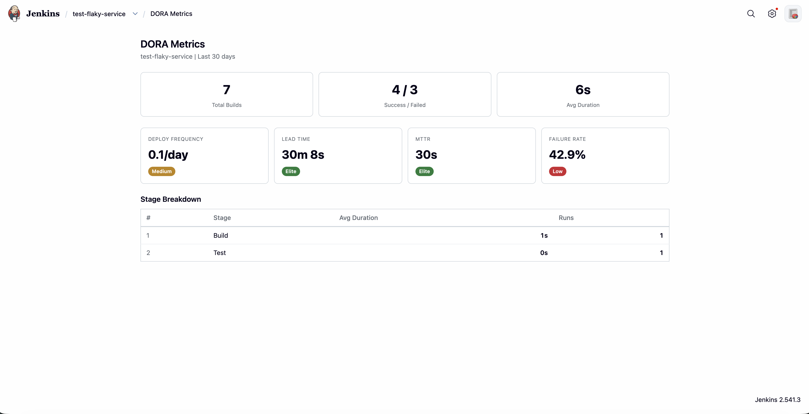
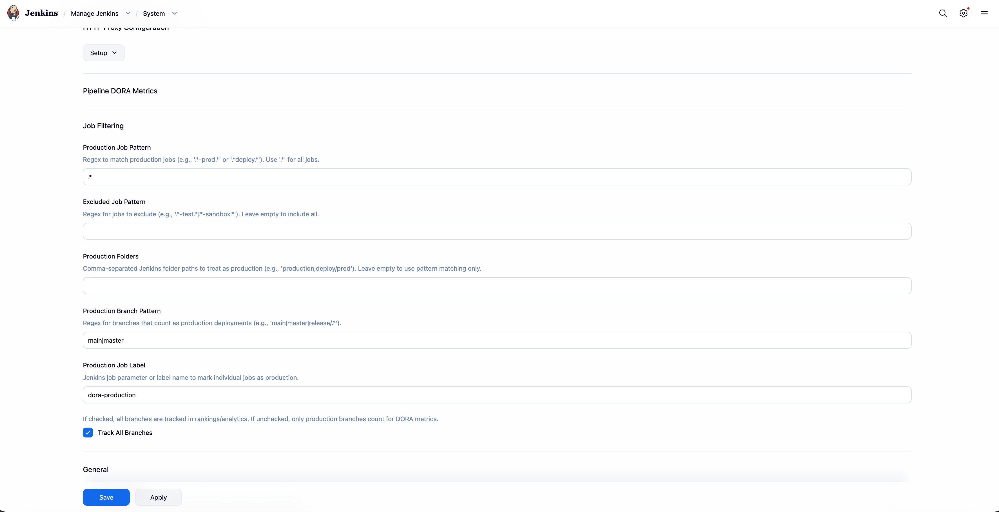

# Pipeline DORA Metrics

A Jenkins plugin that tracks all four DORA metrics, pipeline analytics, rankings, and performance trends. No external infrastructure required.



## Features

**DORA Metrics (All 4)**
- Deployment Frequency with DORA band rating (Elite/High/Medium/Low)
- Lead Time for Changes (commit to deploy)
- Mean Time to Restore (failure to recovery)
- Change Failure Rate (% failed deployments)

**Pipeline Rankings**



- Slowest pipelines by average duration
- Most failing pipelines by failure rate
- Most improved (month-over-month duration change)
- Flakiest pipelines (pass-fail-pass pattern detection)

**Stage-Level Insights**



- Slowest stages across all pipelines
- Most failing stages by failure rate

**Dashboard**
- Interactive Chart.js trend charts (build volume, duration over time)
- Sparkline trends on each DORA metric card
- Date range picker (7d / 30d / 90d / 180d / 1y / custom date range)
- Collapsible sections
- Job drill-down links (click any pipeline to see its per-job metrics)
- Per-job DORA Metrics tab on every job page
- CSV and JSON export

**Per-Job Metrics**



**Configuration**



- Production job pattern (regex)
- Excluded job pattern (regex)
- Folder-based job selection
- Branch filtering (main/master or custom)
- Customizable DORA band thresholds
- Configurable data retention period
- External storage export settings (S3, GCS, Azure, HTTP)

**REST API**
```
GET /dora-api/overview?days=30          All 4 DORA metrics
GET /dora-api/pipelines?days=30&limit=10   Pipeline rankings
GET /dora-api/trends?days=90&job=my-pipeline   Time-series trend data
GET /dora-api/export?days=90&format=csv    CSV/JSON bulk export
```

## Requirements

- **Jenkins:** 2.541.3 LTS or later
- **Java:** 21 or later

## Jenkins Version Compatibility

| Jenkins Version | Compatible | Notes |
|----------------|-----------|-------|
| < 2.440 | No | Requires Java 21 and Stapler2 APIs |
| 2.440 - 2.540 | Untested | May work but not officially supported |
| **2.541.x LTS** | Yes | Built and tested against this version |
| 2.555.x LTS | Yes | Forward compatible |
| Future LTS releases | Expected | Jenkins maintains backward compatibility |

The plugin is built against the Jenkins LTS baseline `2.541.3` and uses the Jenkins BOM `bom-2.541.x`. It requires Java 21 (the Jenkins standard since 2.440+). The Stapler2 request/response APIs used by this plugin were introduced in recent Jenkins versions, so older Jenkins installations (pre-2.440) are not supported.

## Installation

1. Download the `.hpi` file from the [Releases](https://github.com/Bisman-Singh/pipeline-dora-metrics/releases) page
2. Go to Jenkins > Manage Plugins > Advanced > Upload Plugin
3. Upload the `.hpi` file and restart Jenkins

The plugin will automatically start collecting metrics from all pipeline builds. No additional configuration required for basic usage.

## Build from Source

```bash
# Requires Java 21 and Maven 3.9+
mvn package -DskipTests
```

The plugin file will be at `target/pipeline-dora-metrics.hpi`.

## How It Works

The plugin uses a `RunListener` to automatically capture build data after every pipeline completes. Data is stored in an embedded H2 database at `JENKINS_HOME/pipeline-dora-metrics/metrics`. No external database setup required.

**Data captured per build:**
- Job name, build number, timestamp, duration, result
- Trigger type (user, SCM, timer, upstream)
- Branch name (from environment variables)
- Stage-level duration and result for each pipeline stage
- SCM commit data for lead time calculation

**Storage:** ~200 bytes per build with stages. 100 builds/day for a year is approximately 7MB.

| Scale | Builds/day | Storage/year |
|-------|-----------|--------------|
| Small team (10 jobs) | 50 | ~3.5MB |
| Medium (50 jobs) | 200 | ~14MB |
| Large (200 jobs) | 1000 | ~70MB |
| Enterprise (1000 jobs) | 5000 | ~350MB |

## Configuration

Navigate to **Manage Jenkins > System** and scroll to the **Pipeline DORA Metrics** section.

**Job Filtering:**
- **Production Job Pattern:** Regex to match production jobs (e.g., `production/.*` or `.*-prod.*`). Default: `.*` (all jobs)
- **Excluded Job Pattern:** Regex to exclude jobs (e.g., `.*-test.*|.*sandbox.*`)
- **Production Folders:** Comma-separated Jenkins folder paths (e.g., `production,deploy/prod`)
- **Production Branch Pattern:** Regex for branches that count as production (e.g., `main|master|release/.*`)

**DORA Thresholds:** Customize the Elite/High/Medium/Low band boundaries for each metric to match your team's standards.

## Architecture

```
io.jenkins.plugins.dorametrics/
├── collectors/
│   └── BuildDataCollector      # RunListener - captures builds, stages, commits
├── dora/
│   └── DoraCalculator          # Computes all 4 DORA metrics (SQL-optimized)
├── rankings/
│   └── PipelineRanker          # Pipeline and stage rankings (SQL aggregates)
├── store/
│   └── MetricsStore            # H2 database with connection reuse
├── ui/
│   ├── DoraApiAction           # REST API at /dora-api/ (auth-protected)
│   ├── DoraDashboardAction     # Dashboard UI at /dora-metrics/
│   ├── DoraDashboardLink       # Manage Jenkins sidebar link
│   └── JobMetricsAction        # Per-job metrics tab
├── util/
│   └── DurationFormatter       # Shared duration formatting
└── DoraGlobalConfiguration     # Plugin settings (secrets encrypted)
```

## Security

- All API endpoints require Jenkins READ permission
- Export secret keys are stored using Jenkins `Secret` class (encrypted on disk)
- SQL queries use parameterized statements (no SQL injection)
- CSV export protects against CSV injection attacks
- SQL ORDER BY clauses are whitelisted (not user-controlled)

## License

MIT
